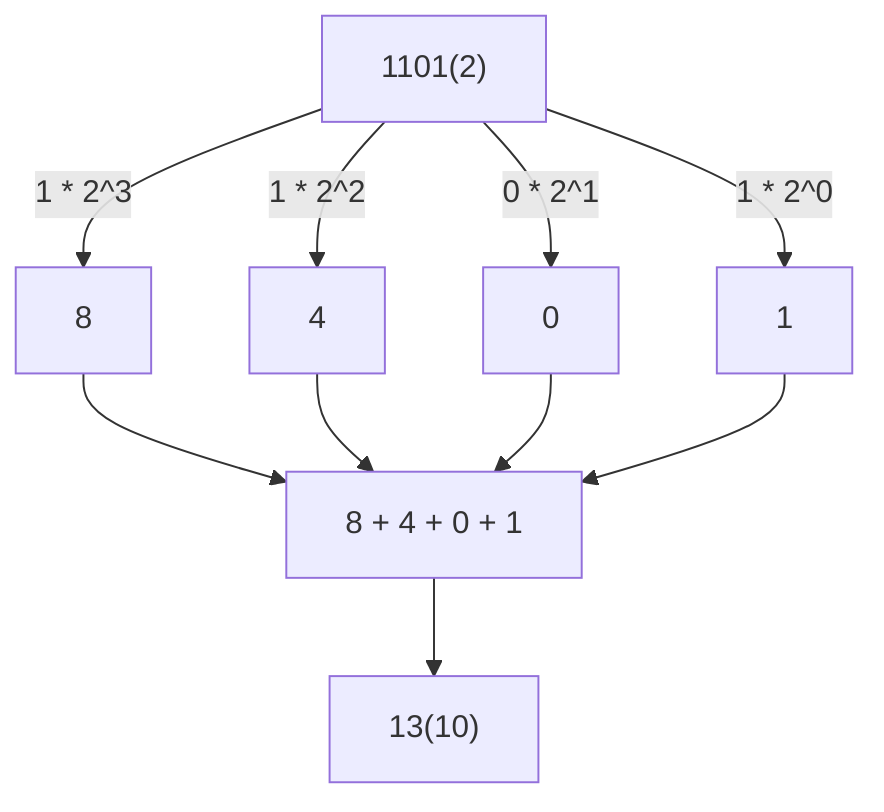
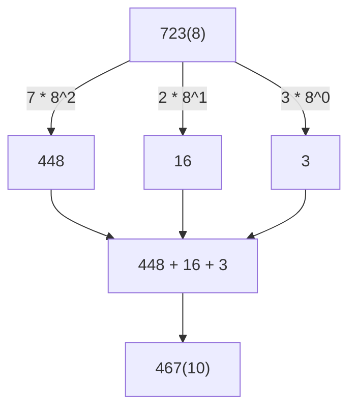

### 1101(2) to 13(10)




### 723(8) to 467(10)




### 3769(16) to 3769(10)

```mermaid
graph TB
    A["EB9(16)"] -->|14 * 16^2| B["3584"]
    A -->|11 * 16^1| C["176"]
    A -->|9 * 16^0| D["9"]
    B --> E["3584 + 176 + 9"]
    C --> E
    D --> E
    E --> G["3769(10)"]
